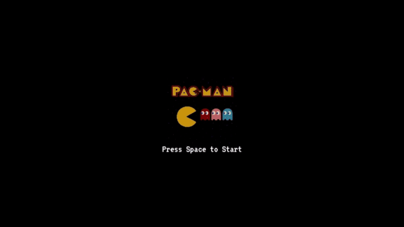

# 🟡 Pacman Game
               
 
A classic Pacman clone built with vanilla JavaScript, HTML5 Canvas, and CSS. <br>
This project recreates the nostalgic arcade experience, featuring AI-controlled ghosts, scoring, lives system, and collision mechanics.

<br>

---

## 🎮 Features
- Classic Gameplay – Eat all the food pellets while avoiding ghosts.
- Ghost AI – Ghosts use pathfinding (BFS) and random targeting for chasing Pacman.
- Lives System – Pacman starts with 3 lives.
- Scoring – Collect pellets to increase your score.
- Start & Game Over Screens – With blinking start text and restart prompt.
- Smooth Animations – Sprite-based animations for Pacman and ghosts.
- Keyboard Controls – Arrow keys / WASD to move, Space to start or restart.

  <br>

---

## 🕹️ Controls


| Key / Mouse           |        Action               |
|-------------------|-------------------------------------|
| ⬅️ / A         | Move Left        |
| ➡️ / D   | Move Right   |
| ⬆️ / W | Move Up           |
| ⬇️ / S| Move Down             |
|  space  |  Start / Restart   |

<br>

---

## 🎬Demo

<p align="center">
  
</p>

Check out the live Snake Game here 👉 [Play Pacman Game](https://thinal-fernando.github.io/pacman-game/)


<br>

---

## 📂 Project Structure

```bash
pacman-game/
│── index.html       # Entry point (canvas + assets loader)
│── game.js          # Main game loop, rendering, score & lives
│── pacman.js        # Pacman class (movement, collision, animation)
│── ghost.js         # Ghost class (AI pathfinding + chasing logic)
│── assets/          # Sprites & images 
     │── animations.gif
     │── ghost.png
     │── startImage.png
```

<br>

---

## ⚡ Getting Started

```bash
# Clone the repository:
git clone https://github.com/your-username/pacman-game.git

# Open index.html in your browser.
```
Enjoy the game! 🎉

<br>

---

## 🛠️ Tech Stack
- JavaScript (ES6) – Core logic & game mechanics
- HTML5 Canvas – Rendering graphics
- CSS – Styling & layout
- Sprite Sheets – Pacman & Ghost animations

<br>

<br>


⭐ Feel free to contribute, fork, or open issues to improve this project.


